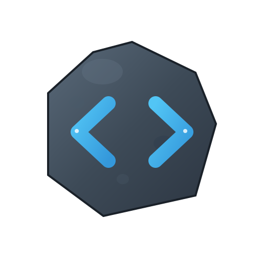

<p align="center">
  
</p>

# StoneScriptPHP

[](https://github.com/progalaxyelabs/StoneScriptPHP/actions/workflows/php-test.yml)
[](https://packagist.org/packages/progalaxyelabs/stonescriptphp)
[](LICENSE)
[](composer.json)
[](https://marketplace.visualstudio.com/items?itemName=progalaxyelabs.stonescriptphp-snippets)
[](https://marketplace.visualstudio.com/items?itemName=progalaxyelabs.stonescriptphp-snippets)

A modern PHP backend framework for building APIs with PostgreSQL, inspired by Angular routing, MCP-style CLI commands, and Laravel's elegance for a streamlined developer experience.

Built for developers who value clean architecture and rapid API development, StoneScriptPHP combines PostgreSQL's power with an intuitive CLI workflow. Visit [stonescriptphp.org](https://stonescriptphp.org) for comprehensive guides and tutorials.

---------------------------------------------------------------

## Installation

Create a new StoneScriptPHP project:

```bash
composer create-project progalaxyelabs/stonescriptphp my-api
cd my-api
```

The setup wizard will:
1. Ask you to choose a starter template (Basic API, Microservice, SaaS Boilerplate)
2. Scaffold your project structure from the selected template
3. Configure database connection
4. Generate JWT keys
5. Run initial migrations

Start development server:

```bash
php stone serve
# Your API is running at http://localhost:9100
```

**New to StoneScriptPHP?** Check out the [Getting Started Guide](docs/getting-started.md) for a complete walkthrough.

## Upgrading

Update the framework to the latest version:

```bash
composer update progalaxyelabs/stonescriptphp
```

The framework is installed in `vendor/` and your application code in `src/` remains completely untouched during upgrades. The upgrade process:
- ✅ Updates only framework files in `vendor/`
- ✅ Preserves all your application code in `src/`
- ✅ Maintains database migrations history
- ✅ Keeps configuration files (.env, routes.php) unchanged

**Coming in v1.3.0:** `php stone upgrade` - An intelligent upgrade command that selectively updates framework files with conflict resolution.

## Versioning Strategy

StoneScriptPHP follows [Semantic Versioning](https://semver.org/):

- **Patch versions (2.0.x)**: Bug fixes, security patches, minor improvements. Safe to update anytime.
- **Minor versions (2.x.0)**: New features, backward-compatible changes. Update when you need new functionality.
- **Major versions (x.0.0)**: Breaking changes, major architectural updates. Review migration guide before updating.

The framework and server are versioned together during major releases but may have different patch versions as bugs are fixed independently. The server's `composer.json` uses `^2.0` to automatically receive framework patch updates while staying on the same major version.

**Current stable:** v2.0.x - Production-ready with ongoing bug fixes

## Features

### Core Framework
- **Angular-like CLI** - `php stone` commands for code generation
- **PostgreSQL-first** - Built for PostgreSQL with migration system
- **Fast Development** - Code generators for routes, models, migrations
- **Guided Setup** - Interactive wizard for project initialization

### Security & Auth
- **JWT Authentication** - RSA & HMAC support, built-in OAuth (Google)
- **RBAC** - Role-Based Access Control with permissions
- **Security Middleware** - CORS, rate limiting, security headers

### Performance & Monitoring
- **Redis Caching** - Optional Redis integration with cache tags, TTL, automatic invalidation
- **Production Logging** - PSR-3 compatible, console + file output, colorized
- **Exception Handling** - Global exception handler with structured errors
- **Validation Layer** - Powerful request validation with 12+ built-in rules

### Developer Experience
- **Color-Coded Logs** - Beautiful ANSI-colored console output
- **Comprehensive Docs** - 20+ documentation files (600+ pages)
- **Testing** - PHPUnit test suite included
- **VS Code Extension** - Snippets and IntelliSense

## CLI Commands

```bash
php stone setup              # Interactive project setup
php stone serve              # Start dev server (port 9100)
php stone generate route <name>   # Generate route handler
php stone generate model <file>   # Generate model from SQL function
php stone migrate verify     # Check database drift
php stone test               # Run PHPUnit tests
php stone env                # Generate .env file
```

For detailed CLI usage, see [CLI Usage Guide](docs/CLI-USAGE.md)

## Workflow

### 1. Define Database Schema

Create all the database tables in individual `.pssql` files in the `src/App/Database/postgres/tables/` folder

### 2. Create SQL Functions

Create all the database queries as SQL functions in individual `.pssql` files in the `src/App/Database/postgres/functions/` folder

If there is seed data, create those as SQL scripts (insert statements) as `.pssql` files in the `src/App/Database/postgres/seeds/` folder

In pgadmin4, develop PostgreSQL functions. Test them and once working, save them as individual files under `src/App/Database/postgres/functions/` folder.

Example: `src/App/Database/postgresql/functions/function_name.pssql`

### 3. Generate PHP Model Class

Use the CLI to generate a PHP class for each SQL function that will help in identifying the function arguments and return values:

```bash
php stone generate model function_name.pssql
```

This will create a `FnFunctionName.php` in `src/App/Database/Functions` folder.

This can be used to call the SQL function from PHP with proper arguments with reasonable typing that PHP allows.

### 4. Create Service Class (Recommended)

For better code organization and testability, create a Service class to contain your business logic:

```php
// src/App/Services/TrophyService.php
namespace App\Services;

use Database\Functions\FnUpdatetrophyDetails;

class TrophyService
{
    /**
     * Update trophy details
     * Pure business logic - no HTTP, no auth
     */
    public function updateTrophyDetails(int $user_trophy_id, int $count): object
    {
        return FnUpdatetrophyDetails::run($user_trophy_id, $count);
    }
}
```

**Why Service Layer?**
- **Testability**: Business logic can be tested without HTTP/auth concerns
- **Reusability**: Same logic can be used from multiple routes
- **Separation of Concerns**: Routes handle HTTP (validation, auth, cookies), Services handle business logic

### 5. Create API Route

```bash
php stone generate route update-trophies
```

This will create a `UpdateTrophiesRoute.php` file in `Routes` folder.

### 6. Create URL to Class Route Mapping

In `src/App/Config/routes.php`, add a URL-to-class route mapping.

Example: For adding a POST route, add the line in the `POST` section:

```php
return [
    ...
    'POST' => [
         ...
        '/update-trophies' => UpdateTrophiesRoute::class
        ...
    ]
    ...
];
```

### 7. Implement the Route Class's Process Function

In `UpdateTrophiesRoute.php`, in the `process` function, delegate to the service layer:

**With Service Layer (Recommended):**

```php
class UpdateTrophiesRoute implements IRouteHandler
{
    private TrophyService $trophyService;

    public function __construct()
    {
        $this->trophyService = new TrophyService();
    }

    public function validation_rules(): array
    {
        return [
            'user_trophy_id' => 'required|integer',
            'count' => 'required|integer',
        ];
    }

    public function process(): ApiResponse
    {
        // Extract and validate input
        $input = request_body();

        // Authenticate user (if needed)
        $user_id = auth_user_id(); // Returns null if not authenticated

        // Call service (pure business logic)
        $data = $this->trophyService->updateTrophyDetails(
            $input['user_trophy_id'],
            $input['count']
        );

        // Handle HTTP response (could add cookies, headers, etc. here)
        return res_ok(['course' => $data]);
    }
}
```

**Without Service Layer (Simple cases):**

For very simple routes with no business logic, you can call database functions directly:

```php
public function process(): ApiResponse
{
    $input = request_body();

    $data = FnUpdatetrophyDetails::run(
        $input['user_trophy_id'],
        $input['count']
    );

    return res_ok(['course' => $data]);
}
```

### 8. Run Migrations

```bash
php stone migrate verify
```

This checks for database drift and ensures your database schema matches your source code.

## Accessing Environment Variables

StoneScriptPHP uses a type-safe Env class to access environment variables from `.env`:

### Framework Variables

The framework provides these core variables out of the box:

```php
use Framework\Env;

$env = Env::get_instance();

// Debug & System
$env->DEBUG_MODE;      // bool - Enable detailed error reporting
$env->TIMEZONE;        // string - Application timezone (default: 'UTC')

// Database
$env->DATABASE_HOST;     // string - Database host
$env->DATABASE_PORT;     // int - Database port
$env->DATABASE_USER;     // string - Database username
$env->DATABASE_PASSWORD; // string - Database password
$env->DATABASE_DBNAME;   // string - Database name
$env->DATABASE_TIMEOUT;  // int - Connection timeout
$env->DATABASE_APPNAME;  // string - Application name for connections

// Email (ZeptoMail)
$env->ZEPTOMAIL_BOUNCE_ADDRESS;  // string
$env->ZEPTOMAIL_SENDER_EMAIL;    // string
$env->ZEPTOMAIL_SENDER_NAME;     // string
$env->ZEPTOMAIL_SEND_MAIL_TOKEN; // string
```

### Application-Specific Variables

Applications can extend `Framework\Env` to add their own variables. The server template includes:

```php
use Framework\Env;

$env = Env::get_instance();  // Returns App\Env instance if it exists

// Application variables (from App\Env)
$env->APP_NAME;              // string - Application name
$env->APP_ENV;               // string - Environment (development, production)
$env->APP_PORT;              // int - Default server port

// JWT Configuration
$env->JWT_PRIVATE_KEY_PATH;  // string - Path to JWT private key
$env->JWT_PUBLIC_KEY_PATH;   // string - Path to JWT public key
$env->JWT_EXPIRY;            // int - Token expiry in seconds

// CORS
$env->ALLOWED_ORIGINS;       // string - Comma-separated origins

// OAuth
$env->GOOGLE_CLIENT_ID;      // string - Google OAuth client ID
```

### Extending Env for Your Application

Create or modify `src/App/Env.php`:

```php
<?php
namespace App;

use Framework\Env as FrameworkEnv;

class Env extends FrameworkEnv
{
    // Add your custom properties
    public $STRIPE_API_KEY;
    public $SLACK_WEBHOOK_URL;

    /**
     * Override getSchema to add your variables
     */
    public function getSchema(): array
    {
        $parentSchema = parent::getSchema();

        $appSchema = [
            'STRIPE_API_KEY' => [
                'type' => 'string',
                'required' => true,
                'default' => null,
                'description' => 'Stripe API key'
            ],
            'SLACK_WEBHOOK_URL' => [
                'type' => 'string',
                'required' => false,
                'default' => null,
                'description' => 'Slack webhook for notifications'
            ],
        ];

        return array_merge($parentSchema, $appSchema);
    }
}
```

The framework automatically detects `App\Env` and uses it instead of `Framework\Env`.

**Supported types:** `string`, `int`, `bool`, `float`

For more details, see [Environment Configuration](docs/environment-configuration.md).

## OAuth Support

StoneScriptPHP includes built-in Google OAuth support:

- `Framework/Oauth/Google.php` - Google OAuth handler
- Automatic JWT token generation
- Secure keypair management

## Testing

Run the test suite:

```bash
php stone test

# Or use composer
composer test
```

## Requirements

### Required
- PHP >= 8.2
- PostgreSQL >= 13
- Composer
- PHP Extensions: `pdo`, `pdo_pgsql`, `json`, `openssl`

### Optional
- Redis server (for caching support)
- PHP Extension: `redis` (for Redis caching)

## Documentation

### 📖 Main Documentation
- **[📑 Documentation Index](docs/INDEX.md)** - Complete documentation with website-style navigation
- **[🏗️ High Level Design (HLD)](HLD.md)** - System architecture and design patterns
- **[📋 Release Notes](RELEASE.md)** - Version history and changelog

### 🚀 Getting Started
- [Getting Started Guide](docs/getting-started.md) - Complete tutorial from installation to deployment
- [CLI Usage Guide](CLI-USAGE.md) - Command reference for `php stone`
- [Environment Configuration](docs/environment-configuration.md) - Type-safe environment setup

### 🔧 Core Features
- [API Reference](docs/api-reference.md) - Complete API documentation with examples
- [Environment Configuration](docs/environment-configuration.md) - Type-safe environment setup
- [Logging & Exceptions](docs/logging-and-exceptions.md) - **NEW** Production-ready logging system
- [Request Validation](docs/validation.md) - Validation rules and usage guide
- [Middleware Guide](docs/MIDDLEWARE.md) - Middleware system and custom middleware

### 🔐 Security
- [Authentication](docs/authentication.md) - JWT and OAuth implementation
- [RBAC (Access Control)](docs/RBAC.md) - Role-Based Access Control
- [Security Best Practices](docs/security-best-practices.md) - Comprehensive security guide

### ⚡ Performance
- [Redis Caching Guide](docs/CACHING.md) - Cache tags and automatic invalidation
- [Performance Guidelines](docs/performance-guidelines.md) - Optimization strategies

### 📚 Additional Resources
- [API Design Guidelines](docs/api-design-guidelines.md) - REST API design patterns
- [Coding Standards](docs/coding-standards.md) - PHP coding conventions
- [Online Documentation](https://stonescriptphp.org/docs)
- [Examples](examples/)

## Development

The framework uses PostgreSQL as its primary database and follows a function-first approach:

1. Write SQL functions that encapsulate business logic
2. Generate PHP models from these functions
3. Create routes that call the models
4. Map URLs to route handlers

This approach keeps your business logic close to the data and leverages PostgreSQL's powerful procedural capabilities.

## Composer Scripts

```bash
composer serve    # Start development server
composer test     # Run PHPUnit tests
composer migrate  # Run database migrations
```

## License

MIT

## Support

- Website: https://stonescriptphp.org
- Documentation: https://stonescriptphp.org/docs
- Issues: https://github.com/progalaxyelabs/StoneScriptPHP/issues
- Source: https://github.com/progalaxyelabs/StoneScriptPHP
